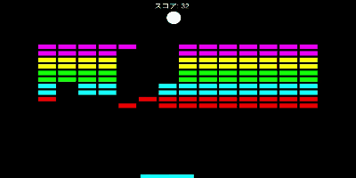

# brick-breaker
## 💡 Overview
A block-breaking web app created using ChatGPT.

## 🖼️ Screenshot

## 🕹️ How to Play
1. Use the left and right arrow keys to move the paddle and bounce the ball.  
2. The game is over when the ball falls.  
3. The game is cleared when all bricks are destroyed.  

## 🛠️ Tech Stack

## 🌐 Web Page
Here is the [Game Page](https://pw56.github.io/brick-breaker)
