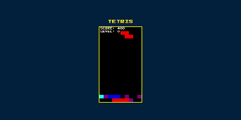

# Tetris

## 💡 Overview
This is a Tetris web app created using ChatGPT.

## 🖼️ Screenshot

## 🕹️ How to Play
1. Press the Start button or the Space key to begin the game
2. Use the Left and Right arrow keys to move the falling block horizontally
3. Use the Down arrow key to drop the block quickly
4. Use the Up arrow key to rotate the block
5. After Game Over, press the Retry button or the Space key to try again

## 🛠️ Tech Stack

## 🧩 Assets
### Sound Effects
- [Sound Effect Lab](https://soundeffect-lab.info)
- [Failure, Game Over](https://dova-s.jp/se/play601.html)
### BGM
- [Archetype: Moonlight](https://dova-s.jp/bgm/play22262.html)

## 🌐 Web Page
Here is the [Game Page](https://pw56.github.io/browser-games/tetris).
